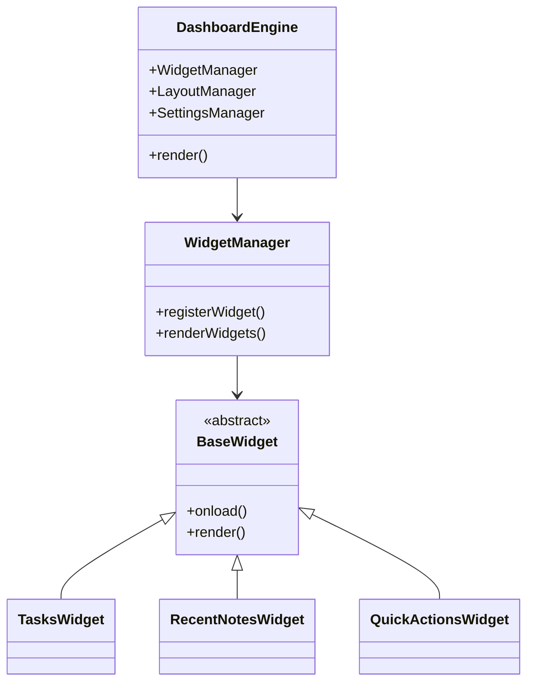

# Enhanced Hometab for Obsidian

Welcome to **Enhanced Hometab**, the definitive dashboard plugin for Obsidian. It replaces the boring blank home tab with an intelligent, highly-customizable, and performant dashboard that integrates seamlessly with your vault.

## Features

- 🚀 **Performant**: Built with asynchronous chunking to ensure zero UI freezes, even on massive vaults with tens of thousands of notes.
- 🎨 **Beautiful & Native**: Strict adherence to Obsidian's native UI/UX paradigms with smooth CSS-accelerated staggered load animations. No bloated external CSS frameworks.
- 🧩 **Modular Widget System**: A robust widget architecture that allows you to enable, disable, and reorder widgets via native HTML5 drag-and-drop.
- 🔍 **Omni-Bar Search Engine**: Fuzzy search across your vault with virtualized rendering for instant typing response.
- ⚡ **Quick Actions**: Instantly create notes, folders, or open settings.
- ✅ **Tasks Integration**: Automatically parses your recently modified notes for open checkboxes, seamlessly allowing you to check them off directly from the dashboard.

## Installation

### Manual Installation
1. Download the latest release from the [Releases](https://github.com/your-repo/releases) page.
2. Extract the `main.js`, `manifest.json`, and `styles.css` files.
3. Place them in your vault's `.obsidian/plugins/enhanced-hometab` folder.
4. Reload Obsidian and enable the plugin in Settings > Community Plugins.

## Usage
The dashboard opens automatically when you start Obsidian. You can also open it by clicking the Home icon in the left ribbon or by using the command palette: `Enhanced Hometab: Open Dashboard`.

Use the plugin settings tab to:
- Change the greeting name.
- Toggle the date display.
- Enable or disable specific widgets.

## Architecture

Enhanced Hometab is built on a modular `Component` architecture. 

To create a new widget, simply extend `BaseWidget`, implement the `render()` method, and register it in the `DashboardEngine`.
